# [Command Line Output](/Labs/Lab2/lab2_output.txt)
### Note that the txt file above shows a text file of the output of commands used in the lab

## Screenshots

---
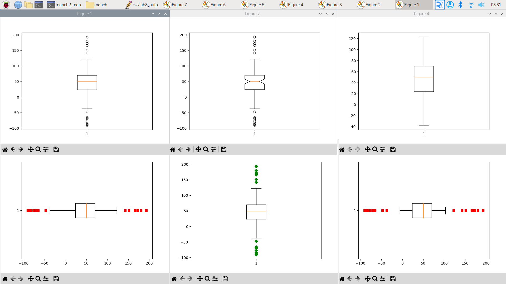
---
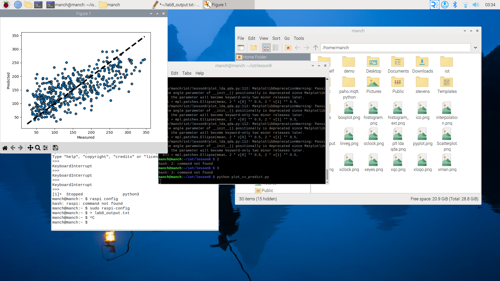
---
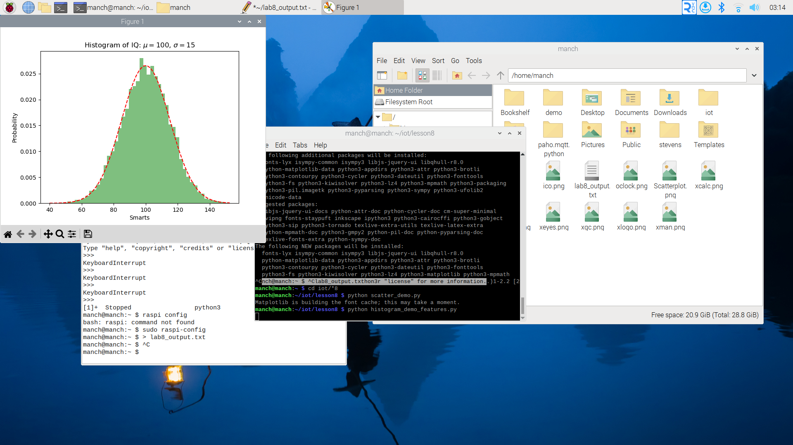
---
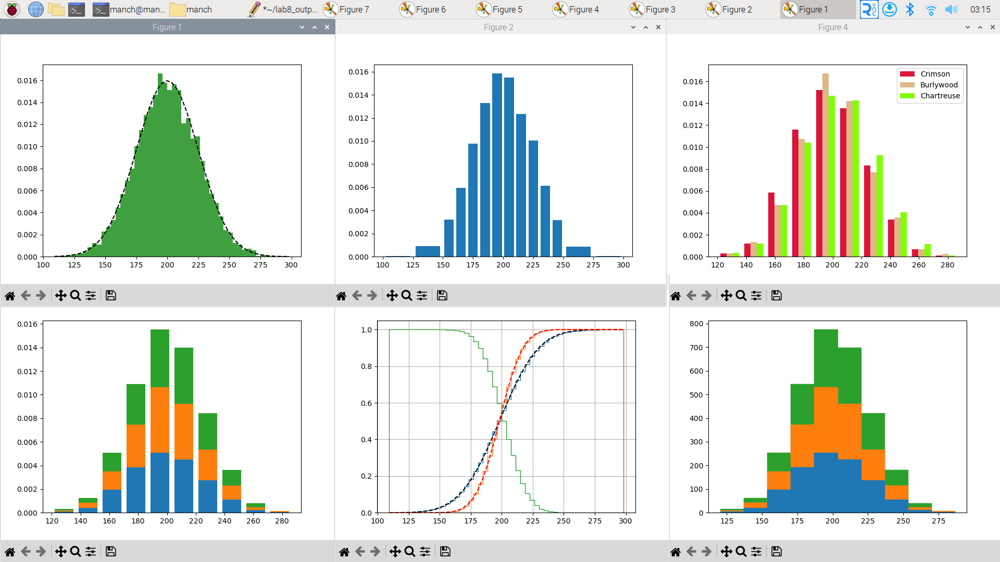
---
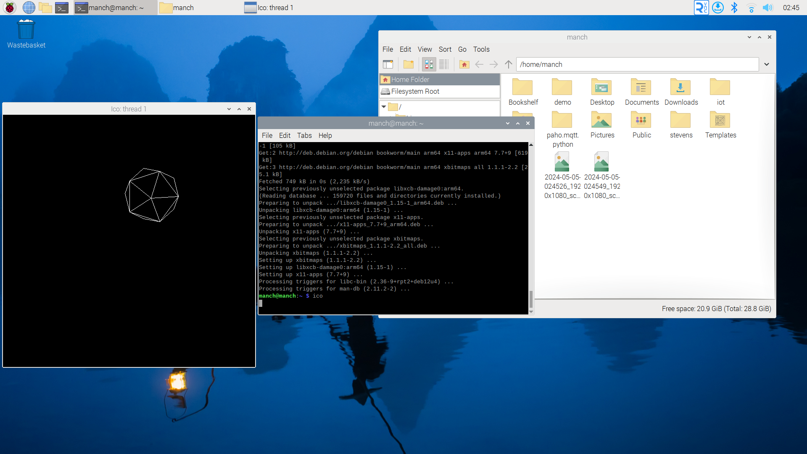
---
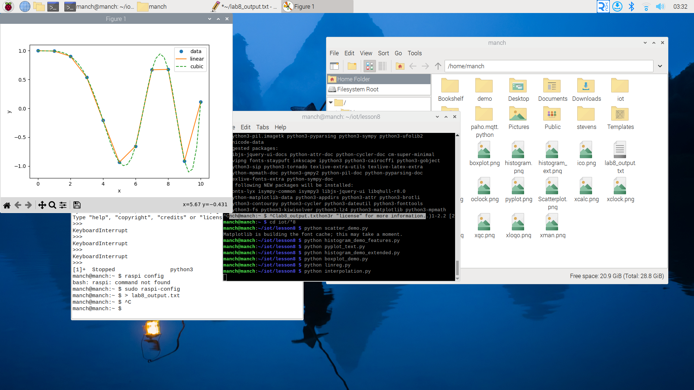
---
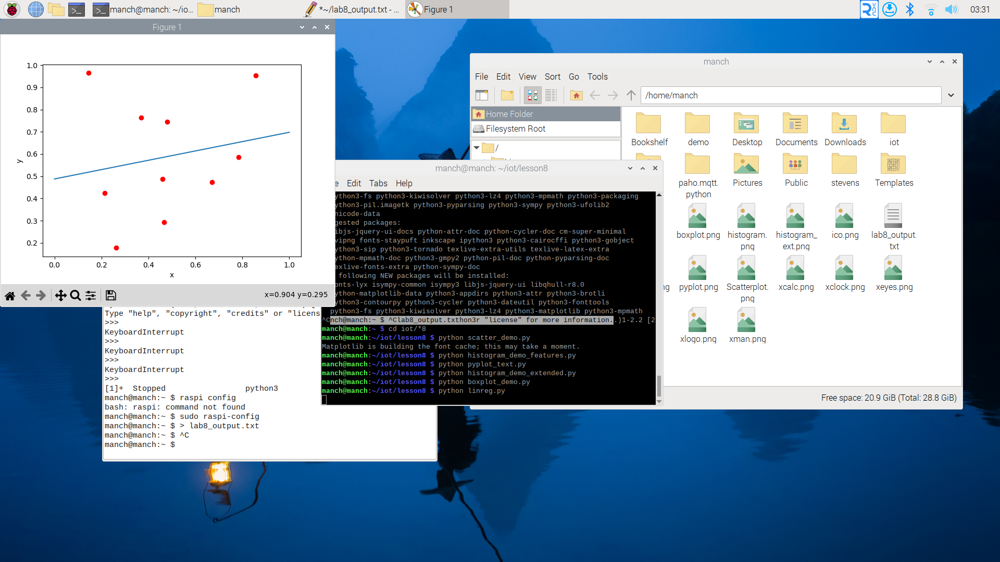
---
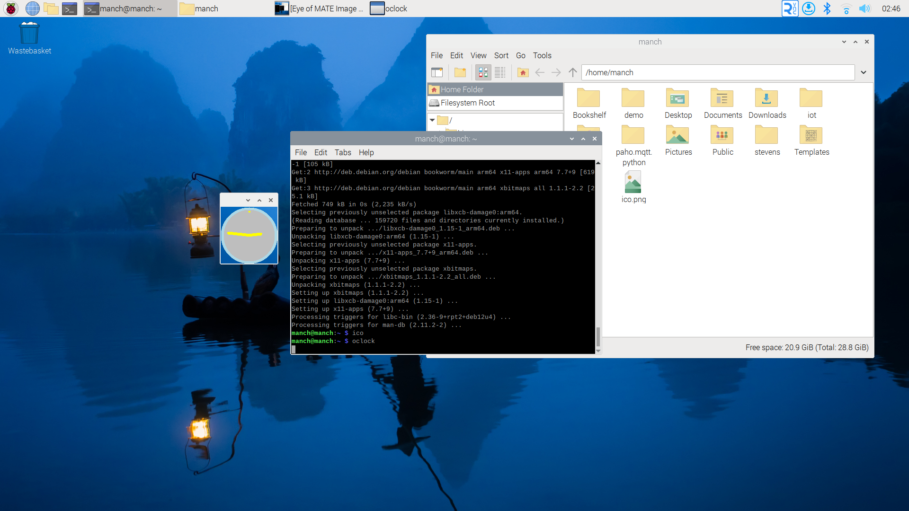
---
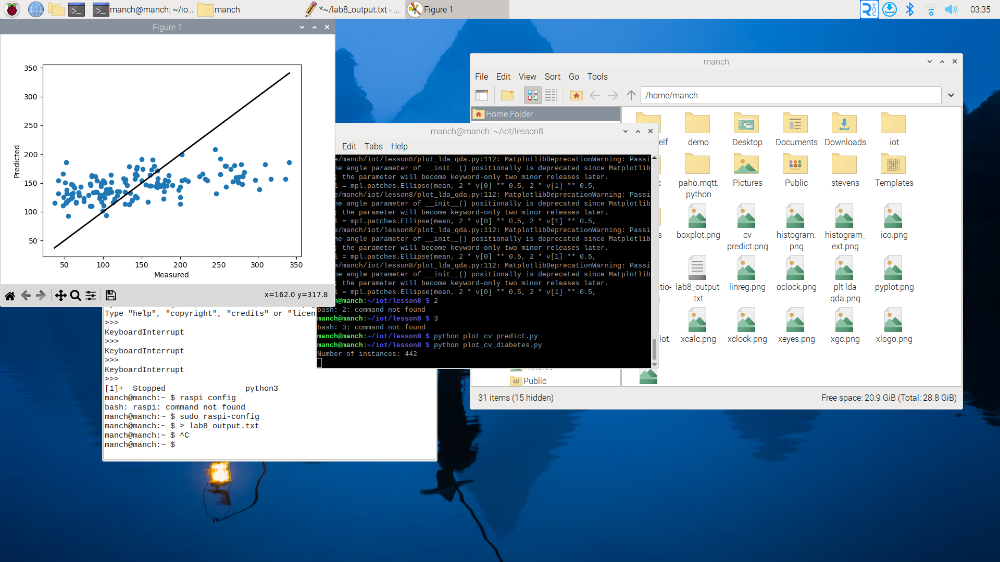
---
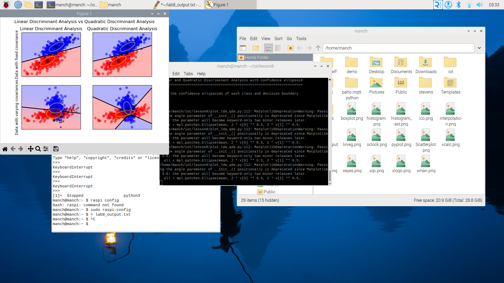
---
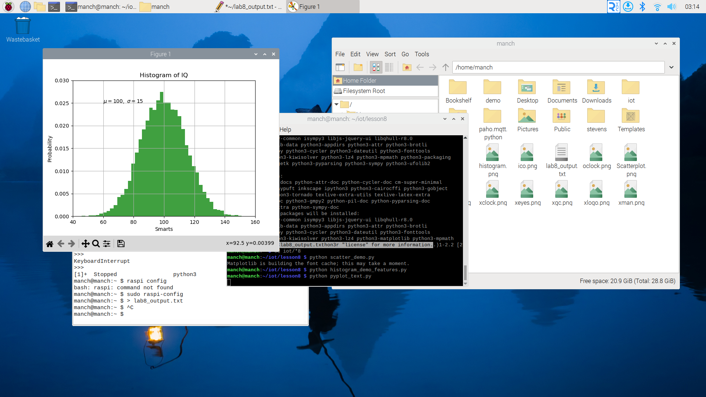
---
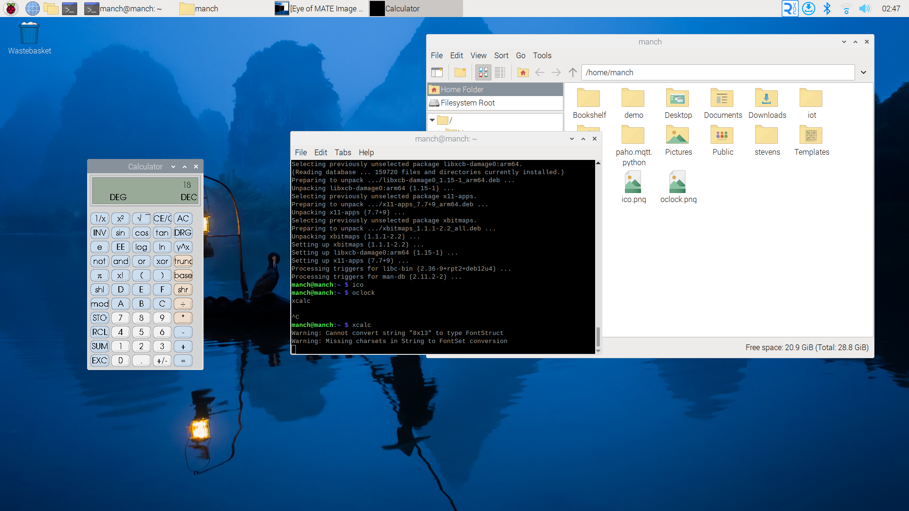
---
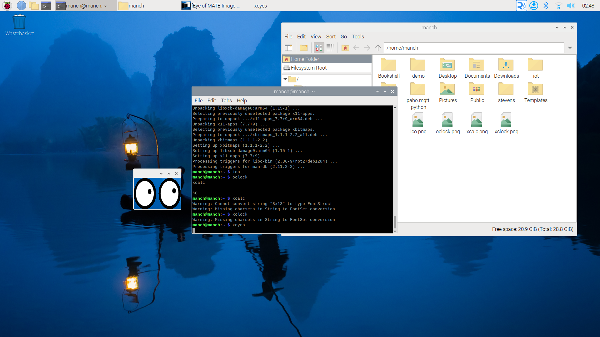
---
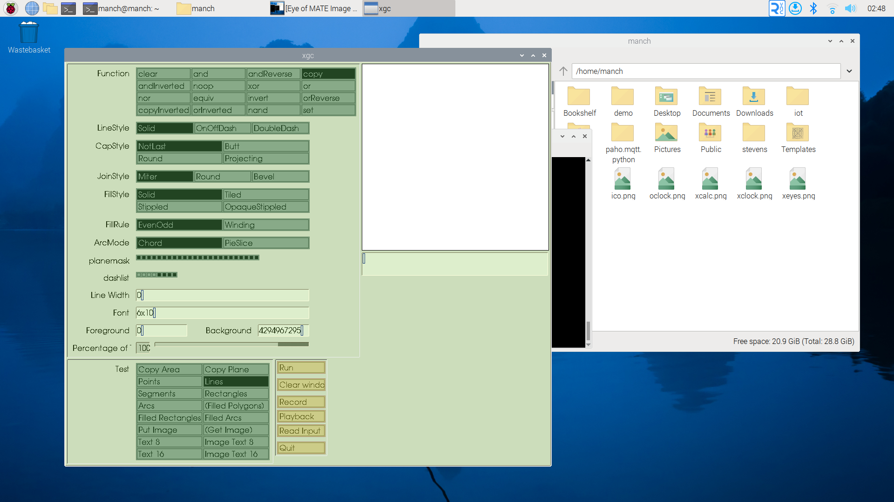
---
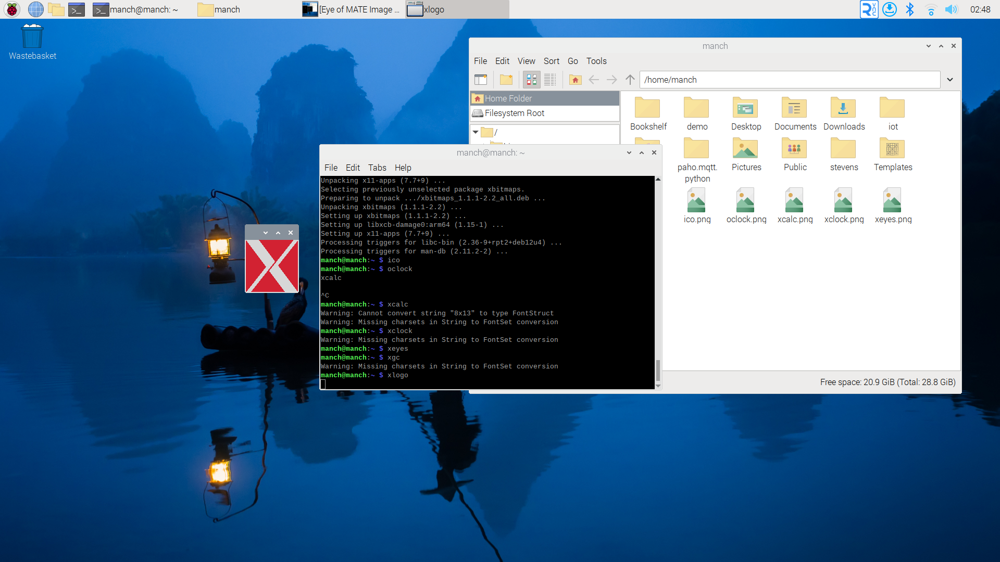
---
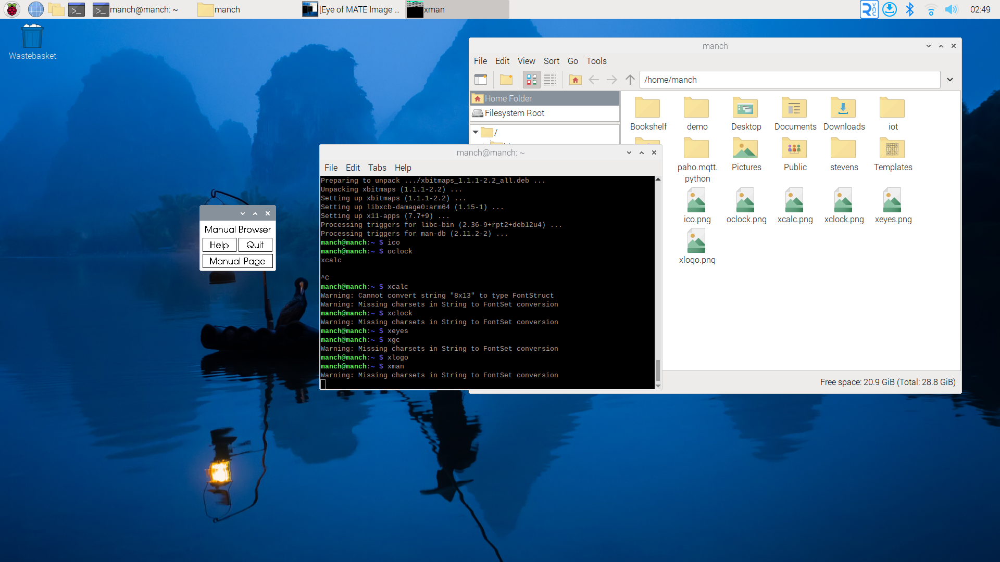
---
